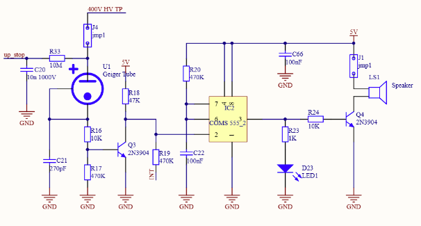

# Muon Detection Project
## Project Description
A muon detector designed for instructional use and data analysis, using inexpensive Geiger counter modules. By stacking two modules and narrowing their field of view, we can detect muons (high-energy cosmic particles capable of penetrating both counters)  through coincidence detection. The signal outputs are processed through a custom-built coincidence detection circuit.
## Background
During my first co-op at ASL Environmental Sciences, I gained experience working with time-series datasets and MATLAB. Inspired to continue this skill development, I began a personal project. A discussion with my father (a physics teacher) about how students struggle with understanding muons in special relativity led to the idea of building an affordable muon detector for his classroom. My design follows a similair layout to this paper discussing muon detection. With a difference in coincidence window size.
## Pulse Width Optimization and Circuit Modifications
The stock Geiger counter modules output a 1 ms pulse, a wide window for coincidence detection which increases the chance of false positives and missed muon events. Since muons travel at nearly the speed of light, minimizing the time window is critical for accurate detection.
### Theoretical vs. Practical Analysis
From the module schematic, I identified a 555 timer in a monostable configuration, controlling the pulse width, as seen below:

### Adjusted Timing Window
I replaced capcitor C22 (true value 1nF not 100nF) with a 180pF capacitor in both geiger counter units, as show below:

### Pulse Width Analysis and Discrepancy
During circuit analysis, I identified a significant discrepancy between theoretical and measured pulse widths:

1. **Identified Monostable Configuration** in the stock Geiger counter modules using 555 timer ICs  
Which has equation: `T = 1.1 × R × C`
3. **Calculated Expected Pulse Width**:  
   `1.1 × 1nF × 470kΩ = 517μs`
   (before replacing C22)  
   `1.1 × 180pF × 470kΩ = 93μs`
   (after replacing C22)
4. **Measured Pulse Width (using vintage oscilliscope)**:  
   ~ 1ms (before replacing C22)  
   ~ 400μs (after replacing C22)
5. **Potential Causes Under Investigation**
   - Incorrect circuit schematic
   - Component tolerance variations
   - Measurement equipment limitations
  
## Detection Methods Comparison
### Software Approach (Arduino Uno):
```cpp
  attachInterrupt(digitalPinToInterrupt(2), tube_events1, FALLING);
  attachInterrupt(digitalPinToInterrupt(3), tube_events2, FALLING);
```
**Concurrency and Overloading Constraints**  
  - Sequential checking of pin status creates detection blind spots
  - Loop execution can obscure simultaneous events (e.g. Serial.print() or sensor reads blocking for ~50-200μs)
  - Resource contention with concurrent data logging and environmental sensor polling

### Hardware Solution:
  - Sub-microsecond response time
  - True parallel signal processing
  - Configurable time window sizes via passive components
I used the CD4093 IC chip which is a schmidtt trigger NAND which accounts for potential signal variations that remain after the 555 chip processing. I tested the circuit using a simple breadboard implementation and it seems to run as expected.


## Current and Future Plans
### Coincidence Detection Circuit
My coincidence detection circuit takes output from each of the 555 timers on the respective modules from which I soldered a connector wire. These connections will be input to the nand gate and the result will be inverted. The current circuit schematic can be seen below:


