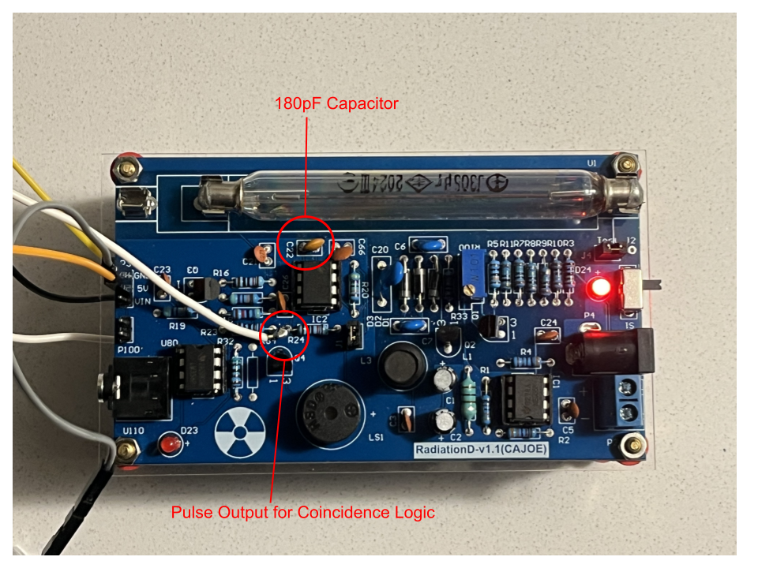
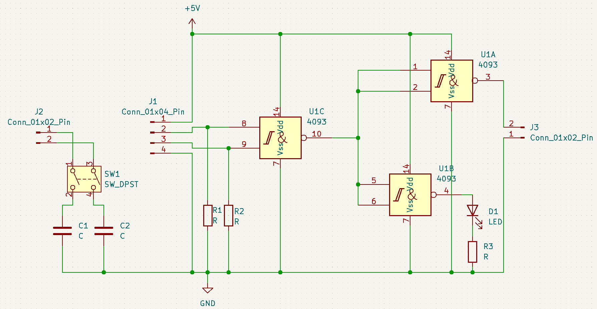

# Muon Detection Project (In Progress)
## Project Description
A muon detector designed for instructional use and data analysis, using inexpensive Geiger counter modules. By stacking two modules vertically, we can detect muons (high-energy cosmic particles capable of penetrating both counters) through coincidence detection. The signal outputs are processed through a custom-built coincidence detection circuit.
## Background
During my first co-op at ASL Environmental Sciences, I gained experience working with time-series datasets and MATLAB. Inspired to continue developing these skills, I began a personal project. A discussion with my father (a physics teacher) about how students struggle with understanding muons in special relativity led to the idea of building an affordable muon detector for his classroom. My design follows a similar layout to a [published paper](https://www.mdpi.com/2571-712X/7/3/34) on muon detection, with some differences in the coincidence window size.
## Pulse Width Optimization and Circuit Modifications
The stock Geiger counter modules output a 1 ms pulse which may be too wide for effective coincidence detection, increasing false positives and missed muon events. Since muons travel near the speed of light, minimizing the detection window is critical.
### Theoretical vs. Practical Analysis
From the module schematic, I identified a 555 timer in a monostable configuration, controlling the pulse width, as shown below:  

### Adjusted Timing Window
I replaced capacitor C22 (true value 1nF not 100nF) with a 180pF capacitor in both Geiger counter units, as shown below:

### Pulse Width Analysis and Discrepancy
During circuit analysis, I found a discrepancy between theoretical and measured pulse widths:
1. **Identified Monostable Configuration** in the stock modules using 555 timer ICs  
Formula: `T = 1.1 × R × C`
3. **Calculated Expected Pulse Width**:  
   `1.1 × 1nF × 470kΩ = 517μs`
   (before replacement)  
   `1.1 × 180pF × 470kΩ = 93μs`
   (after replacement)
4. **Measured Pulse Width (using vintage oscilliscope)**:  
   ~ 1ms (before)  
   ~ 400μs (after)
5. **Possible Explanantions Under Investigation**
   - Incorrect schematic or incorrect component values
   - Tolerance in resistor/capacitor values
   - Measurement limitations with aging test equipment
  
## Detection Methods Comparison
### Software Approach (Arduino Uno):
```cpp
  attachInterrupt(digitalPinToInterrupt(2), tube_events1, FALLING);
  attachInterrupt(digitalPinToInterrupt(3), tube_events2, FALLING);
```
**Limitations**  
  - Sequential pin checking creates detection blind spots
  - Loop execution (e.g. Serial.print()) can block detection for ~50-200μs
  - Resource contention with concurrent data logging and environmental sensor polling

### Hardware Solution:
  - Sub-microsecond response time
  - True parallel signal processing
  - Configurable detection window via passive components
         
I used a CD4093 IC (Schmidtt-trigger NAND) to account for residual signal variations post 555 timer. The breadboard implementation functions as expected:


## Current and Future Plans
### Coincidence Detection Circuit
My circuit takes pulse outputs from each Geiger module (soldered from the 555 timer output) and inputs them into the CD4093 NAND gate, and inverts the result.



The NAND logic ensures output only during true coinicidences. An LED flashes upon detection. Resistors prevent floating inputs, while switches and capacitors allow pulse window adjustment.

By adding the capacitors in parallel with the 180pF timing capacitor via a switch, I can widen the pulse. For example:

- **820pF**: approximates original stock pulse width
- **100nF**: greatly increases pulse width (for demo purposes)

This allows for statistical testing on how pulse width impacts detection rates. For educational demos, longer windows can increase count rate, even if it allows some false positives.

### Circuit Implementation and Data Collection
I'm continuing to test the circuit and investigate pulse timing inconsistencies. Aswell as, determining an optimal seperation distance between the two modules to determine an appropriate field of view for the device. I'm also designing a PCB in KiCad for a more polished, modular unit.

Once finalized, the system will:
- Log data via Arduino Uno to an SD card
- Timestamp events with a real-time clock module
- Optionally incorporate a BMP280 sensor to study how muon detection varies with atmospheric pressure

All data will be saved as CSV and analyzed using MATLAB.
